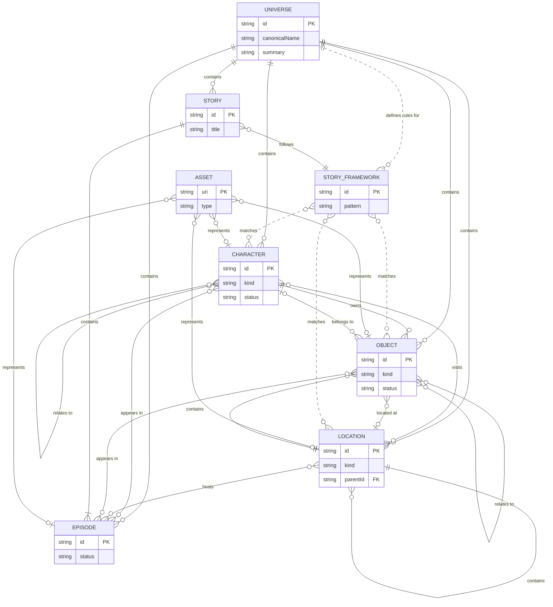

# Whisperwood Universe — Entity Relationship Architecture

Internal architecture reference for developers, contributors, and AI assistants working on the Whisperwood Universe platform.

This document describes **conceptual relationships** between major entity types. It does not define implementation, JSON schemas, or canon content. For schema contracts, see [schemas/](../../schemas/). For authoritative world rules, see [CANON.md](../../CANON.md).

---

## Purpose

Whisperwood Universe is designed to grow over many years — across books, animation, games, websites, and AI-assisted production tools. Before canonical characters, locations, or stories are authored, the **relationship model** must be understood.

Defining relationships before content prevents:

- **Orphan records** — characters, objects, or episodes that reference entities that do not exist
- **Inconsistent linking** — the same relationship expressed differently in JSON, Markdown, and application code
- **Duplicate sources of truth** — the same fact stored in multiple places with conflicting values
- **Tooling fragmentation** — Story Studio, websites, and AI pipelines interpreting the universe differently

Relationships are the **connective tissue** of the platform. Entities are nouns; relationships are verbs. Together they form a graph that every consumer — human or machine — can traverse consistently.

This document should be read **before** reading JSON schemas or creating canonical content.

---

## Core Entity Types

Each entity type has a distinct responsibility in the architecture. None replaces another.

### Universe

The **root container** for everything in Whisperwood. The universe defines identity, audience, themes, values, world rules, and creative boundaries. All other entities exist *within* the universe and must conform to its standards.

**Repository home:** [universe/](../../universe/)

---

### Character

A **person, animal, or vehicle** that participates in stories as a named entity. Characters have identity, personality, relationships, and optional production profiles for voice, animation, and image generation.

Characters are long-lived. They persist across episodes, stories, and media formats.

**Repository home:** [characters/](../../characters/)

---

### Location

A **place** in the Whisperwood world — regions, villages, forests, buildings, rooms, landmarks, and future location types. Locations support hierarchy (a room within a building within a village within a region).

Locations provide setting, atmosphere, and narrative context for stories.

**Repository home:** [locations/](../../locations/)

---

### Object

An **item or artifact** in the world — belongings, props, tools, toys, food, furniture, magical items, and other story-relevant things. Objects may be owned by characters, found at locations, or appear as signature items in episodes.

Objects help stories; they do not encode game mechanics.

**Repository home:** [objects/](../../objects/)

---

### Episode

A **single narrative unit** — one story installment suitable for a book chapter, animated short, game level, or app experience. Episodes have a beginning, middle, and end, and should stand alone while contributing to larger arcs.

Episodes are the primary unit of **canonical storytelling**.

**Repository home:** [episodes/](../../episodes/)

---

### Story Framework

A **reusable narrative pattern** — not a finished story, but a template that describes structure, pacing, thematic goals, and casting requirements. Story Frameworks guide Story Studio and AI story generation when matching characters, locations, and objects to story types.

Examples at the conceptual level: *discovery adventure*, *friendship problem*, *family celebration*, *nature exploration*. Frameworks are editorial tools, not published canon unless explicitly promoted.

**Repository home:** [docs/](../../docs/) and [prompts/](../../prompts/) (frameworks may evolve into dedicated storage as the platform matures)

---

### Story

A **collection or arc** of related episodes united by theme, goal, or narrative continuity. A story may span a book, a season of animation, or a multi-part app experience.

Stories organize episodes; they do not replace them. An episode belongs to one or more stories; a story contains one or more episodes.

**Repository home:** [episodes/](../../episodes/) (story-level metadata may live alongside episodes until a dedicated structure is defined)

---

### Asset

A **media representation** of another entity — illustrations, audio, video, maps, animation clips, concept art, and reference files. Assets do not define canon; they **represent** canonical entities for production and publication.

An asset always points *to* something (a character, location, object, or episode). It is not itself a story entity.

**Repository home:** [assets/](../../assets/)

---

## Relationships

The following describes how entities relate in plain English. Arrows indicate direction of the primary relationship; many relationships are bidirectional in practice (referenced from both sides).

### Universe as root container

| From | Relationship | To | Meaning |
|------|-------------|-----|---------|
| **Universe** | contains | **Characters** | Every character exists within Whisperwood and conforms to universe rules. |
| **Universe** | contains | **Locations** | Every place belongs to the same world and shares foundational geography and tone. |
| **Universe** | contains | **Objects** | Every item belongs to the same world and respects world rules (e.g. gentle magic). |
| **Universe** | contains | **Episodes** | Every published story installment is set in Whisperwood. |
| **Universe** | contains | **Stories** | Every story arc operates within the same creative foundation. |
| **Universe** | defines rules for | **Story Frameworks** | Frameworks must honor universe themes, values, and content boundaries. |

The universe is **singular**. There is one Whisperwood. All entity records reference this root implicitly or explicitly.

---

### Characters and the world

| From | Relationship | To | Meaning |
|------|-------------|-----|---------|
| **Character** | owns | **Object** | A character may possess, carry, or be primarily associated with an object (optional). |
| **Character** | visits | **Location** | Characters appear at places across stories. Visits may be one-time or recurring. |
| **Character** | lives at / belongs to | **Location** | A character may have a home or primary location (optional). |
| **Character** | appears in | **Episode** | Characters are cast in narrative units. |
| **Character** | relates to | **Character** | Characters have friendships, family bonds, and other relationships (peer references). |

Ownership of objects is **optional**. Objects may exist without a permanent owner (found items, shared community objects).

---

### Locations and hierarchy

| From | Relationship | To | Meaning |
|------|-------------|-----|---------|
| **Location** | contains | **Location** | Places nest hierarchically (room → building → village → region). |
| **Location** | contains | **Object** | Objects may be kept, displayed, or found at a location. |
| **Location** | hosts | **Episode** | Episodes are set in one or more locations. |
| **Location** | visited by | **Character** | Inverse of character visits location. |

Location hierarchy uses **stable parent references**. A child location always knows its parent; the graph must not contain cycles.

---

### Objects in the world

| From | Relationship | To | Meaning |
|------|-------------|-----|---------|
| **Object** | belongs to | **Character** | Optional ownership or primary association. |
| **Object** | located at | **Location** | Where the object is usually kept or found. |
| **Object** | appears in | **Episode** | Objects featured in specific narrative units. |
| **Object** | relates to | **Object** | Optional links between related items (components, sets, pairs). |

Objects **help stories**. They are not inventory items with game stats. Capabilities are narrative, not mechanical.

---

### Episodes, stories, and frameworks

| From | Relationship | To | Meaning |
|------|-------------|-----|---------|
| **Episode** | belongs to | **Story** | An episode is part of a larger arc or collection. |
| **Episode** | set in | **Location** | Every episode has one or more settings. |
| **Episode** | features | **Character** | Episodes cast characters. |
| **Episode** | features | **Object** | Episodes may include significant objects. |
| **Story** | contains | **Episode** | A story is made of one or more ordered episodes. |
| **Story** | follows | **Story Framework** | Stories may be instantiated from a reusable narrative pattern. |
| **Story Framework** | guides | **Story** | Frameworks suggest structure; they do not replace authored content. |
| **Story Framework** | matches | **Character**, **Location**, **Object** | Frameworks express casting and setting requirements for Story Studio. |

A **Story Framework** is a pattern. A **Story** is authored canon. An **Episode** is a deliverable unit.

---

### Assets as representations

| From | Relationship | To | Meaning |
|------|-------------|-----|---------|
| **Asset** | represents | **Character** | Illustrations, voice references, model files, etc. |
| **Asset** | represents | **Location** | Maps, backgrounds, establishing shots, etc. |
| **Asset** | represents | **Object** | Product-style illustrations, prop references, etc. |
| **Asset** | represents | **Episode** | Thumbnails, key art, promotional materials, etc. |

Assets are **downstream of canon**. Changing an asset does not change canon. Changing canon may require new assets.

---

### Relationship summary tree

```
Universe
├── contains → Characters, Locations, Objects, Episodes, Stories
│
Characters
├── own → Objects (optional)
├── visit → Locations
└── appear in → Episodes
│
Locations
├── contain → Locations (hierarchy)
├── contain → Objects
└── host → Episodes
│
Objects
├── belong to → Characters (optional)
├── located at → Locations (optional)
└── appear in → Episodes
│
Episodes
├── belong to → Stories
├── set in → Locations
└── feature → Characters, Objects
│
Stories
├── contain → Episodes
└── follow → Story Frameworks
│
Story Frameworks
└── guide → Stories (and inform casting)
│
Assets
└── represent → Characters, Locations, Objects, Episodes
```

---

## Design Principles

These principles govern how the entity model is implemented in the repository and consumed by platform tools.

### Single Source of Truth

Each fact exists in **one authoritative place**. Characters live in `characters/`. Locations live in `locations/`. Cross-references use stable IDs — never duplicate canonical data in application databases without a sync strategy.

### Canon over Implementation

[CANON.md](../../CANON.md) and approved content files define **what is true**. Schemas, apps, and AI tools define **how truth is stored and consumed**. Implementation serves canon; it does not invent it.

### Stable IDs

Every entity has an immutable `id` (kebab-case slug). IDs never change once assigned. Display names, titles, and presentation strings may evolve. All relationships reference **IDs**, not display names.

### JSON as Structured Data

Machine-readable records use JSON conforming to [schemas/](../../schemas/). JSON carries facts: identity, relationships, metadata, production profiles. JSON is validated against schemas before acceptance.

### Markdown as Human Documentation

Narrative prose, creative notes, and long-form profiles use Markdown. Markdown is for **humans**; JSON is for **machines**. Both may exist for the same entity; they must not contradict each other.

### AI-Friendly Architecture

The graph is designed for AI assistants and Story Studio:

- Explicit entity types with clear boundaries
- Stable IDs for reliable cross-referencing
- Schemas that describe shape without embedding lore
- Shared modules in [schemas/shared/](../../schemas/shared/) for consistency

AI tools read schemas and entity records — they do not invent structure.

### Extensibility

New entity types, location kinds, object kinds, and story frameworks can be added without breaking existing records. Custom kinds use extensible classification. Namespaced `extensions` fields allow future consumers to attach data without schema forks.

### Versioning

Documents declare a `schemaVersion`. Schemas evolve with backward compatibility wherever possible. Breaking changes require intentional version bumps and migration guidance.

---

## Future Expansion

This entity model supports every planned Whisperwood format without architectural redesign.

| Platform | How the model applies |
|----------|----------------------|
| **Books** | Episodes map to chapters. Stories map to books. Characters, locations, and objects provide consistent descriptions and art direction. |
| **Animation** | Episodes map to shorts or segments. Assets provide animation references. Character voice and animation profiles feed production pipelines. |
| **YouTube** | Episodes map to published videos. Assets provide thumbnails and key art. Universe tone and values govern all public content. |
| **Websites** | Characters, locations, and objects power browseable canon. Stable IDs drive URLs and APIs. JSON feeds dynamic pages. |
| **Games** | Locations provide maps and levels. Objects provide interactable items (narrative affordances, not stats). Episodes map to quests or levels. |
| **Educational apps** | Story Frameworks match learning goals to stories. Values and themes from the universe guide content selection for ages 4–8. |
| **AI Story Studio** | The full graph is queryable: match frameworks to characters by story function, filter locations by safety profile, attach objects by narrative role. |

The repository remains the **canonical hub**. Every format is a consumer — not a separate canon.

---

## Entity Relationship Diagram



**Legend:**

- `||--o{` — one-to-many (required parent, optional children)
- `}o--o{` — many-to-many
- `}o--o|` — many-to-zero-or-one (optional)
- `}o..o{` — advisory / matching (Story Studio, not hard canon links)
- **PK** — primary stable identifier
- **FK** — foreign reference by stable ID

---

## Related Documentation

| Document | Purpose |
|----------|---------|
| [CANON.md](../../CANON.md) | Highest authority for world facts and rules |
| [PROJECT.md](../../PROJECT.md) | Repository standards and editorial rules |
| [schemas/README.md](../../schemas/README.md) | JSON Schema contracts |
| [universe/README.md](../../universe/README.md) | Universe foundation layer |

---

## Document Status

| Field | Value |
|-------|-------|
| **Version** | 1.0 |
| **Scope** | Conceptual architecture only |
| **Implementation** | Not defined in this document |

Changes to entity relationships require architectural review before canonical content is affected.
